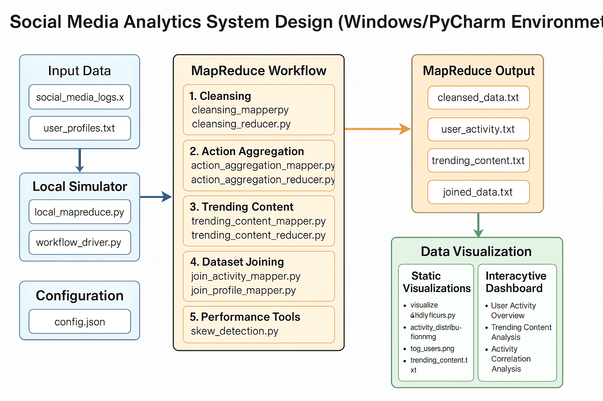

# 📊 Social Media Analytics using MapReduce

Welcome to this project! 👋 It's a complete MapReduce-powered workflow designed to analyze social media logs and user profiles. From identifying top users to trending content and generating cool visualizations — this repo’s got it all! 🚀

---

## 🧠 What's This Project About?

This pipeline works with two main datasets:

- `social_media_logs.txt` 📄
- `user_profiles.txt` 👤

Using MapReduce, it extracts user behavior, detects trending posts, and visualizes everything beautifully!

---

## ⚙️ System Workflow

The solution is divided into 5 components:

1. 🧹 **Data Cleansing & Parsing**  
2. 📈 **Action Aggregation & Sorting**  
3. 🔥 **Trending Content Detection**  
4. 🔗 **Joining User Info with Activity**  
5. 📊 **Visualization (Static + Interactive)**  

---

## 🧱 Architecture Overview



The system is pipeline-based:
- Input ➡ Processed by MapReduce ➡ Intermediate outputs ➡ Final analysis + viz

---

## 🛠️ Prerequisites

- 🪟 Windows OS
- 🐍 Python 3.6+
- 💡 PyCharm (Community or Pro)
- 📦 Python Libraries:
  ```bash
  pip install numpy psutil matplotlib pandas dash plotly scipy
